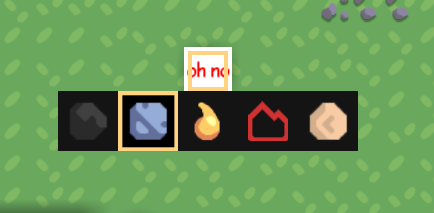

<div align="center">

# MultiCrafter Lib [](https://discord.gg/PDwyxM3waw)

[](https://discord.gg/PDwyxM3waw)
[](https://github.com/liplum/MultiCrafterLib/releases)
[](https://jitpack.io/#liplum/MultiCrafterLib)

A Mindustry mod providing MultiCrafter library for JavaScript mods.
___
</div>

## Showcase


## How to Use

There are three ways to use this MultiCrafter library.
Please check [this tutorial](Info/Tutorial.md) to learn about the syntax.

| Mod Type   | Json | JavaScript | Java | Note                           |
|------------|------|------------|------|--------------------------------|
| Dependency | ✔️   | ✔️         |      | Players need download this mod |
| Injection  |      | ✔️         |      | Keep your mod standalone       |
| Jitpack    |      |            | ✔️   | Full sources code support      |

### As a Mod Dependency

<details open>
<summary>Click to Open</summary>

Add a mod dependency in your `mod.[h]json` file

```hjson
dependencies:["multi-crafter"]
```

<details>
<summary>Json Usage</summary>

Create a normal block file, such as named `multi-function-crafter.hjson`, in the `content/blocks/crafter` folder, and
set its type to `multicraft.MultiCrafter`

```hjson
type: multicraft.MultiCrafter
```

You can add recipes like this:

```hjson
recipes : [{
  input: ozone/1.5
  output: {
      items : [
        copper/1
        graphite/2
      ]
      power : 2.5
  }
  craftTime : 250.0
},{
  input: {
      items : [
        cyber-io-ic/1 // You can add moded items or fluids
        lead/1
      ]
  }
  output: {
      fluids: [
        cyber-io-cyberion/1.2    
      ]
  }
  craftTime : 210.0
}]
```

</details>

<details>
<summary>JavaScript Usage</summary>

Import `multi-crafter/lib.js` in your script, and create a new block with its class name, `MultiCrafter`.

```javascript
const multi = require("multi-crafter/lib")
const mineCrafter = multi.MultiCrafter("mine-crafter")
```

You can create recipes like this:

``` javascript
mineCrafter.recipes = [{
  input: "ozone/1.5"
  output: {
      items : [
        "copper/1","graphite/2"
      ],
      power : 2.5
  },
  craftTime : 250.0
},{
  input: {
      items : [
        // You can add moded items or fluids
        "cyber-io-ic/1","lead/1"
      ]
  },
  output: {
      fluids: ["cyber-io-cyberion/1.2"]
  }
  craftTime : 210.0
}]
```

</details>

</details>

### Class Files Injection

<details>
<summary>Click to Open</summary>

You can download a zip filling with classes you need [here](https://github.com/liplum/MultiCrafterLib/releases/latest).
As a convention, it should be named as `MultiCrafter-<version>.zip`.

You need to unzip this and get its content ...

- If you don't want to publish your mod on GitHub,
  you need put the content into the root directory of your mod's zip file.
- If you've published your mod on GitHub,
  you need upload the content, use `git add` and `git push` or something else,
  into the root directory of your GitHub repository.

In this way, you have to write JavaScript to create your block.

How you can create a block is basically the same as [the way to add a mod dependency](README.md#As-a-Mod-Dependency)
in JavaScript but without a declaration of mod dependency.


</details>

### Jitpack Dependency

<details>
<summary>Click to Open</summary>

You can click here [](https://jitpack.io/#liplum/MultiCrafterLib)
to fetch the latest version of MultiCrafter Lib.

1. Add the JitPack repository to your build file

```groovy
allprojects {
    repositories { maven { url 'https://jitpack.io' } }
}
``` 
2. Add the dependency
```groovy
 dependencies {
   implementation 'com.github.liplum:MultiCrafterLib:<version>'
 }
```
</details>

## Menu Styles

You can select which menu style detailed-described blow you want with a case-insensitive name.

Json:

```hjson
"menu": "Transform"
```

JavaScript:

```javascript
youCrafter.menu = "Transform"
```

### Transform

<details open>
<summary>Click to Open</summary>


</details>

### Simple

<details>
<summary>Click to Open</summary>



</details>

### Number

<details>
<summary>Click to Open</summary>


</details>

### Detailed

<details>
<summary>Click to Open</summary>


</details>

## Author

**Programmer**: Liplum

## Licence

GNU General Public License v3.0