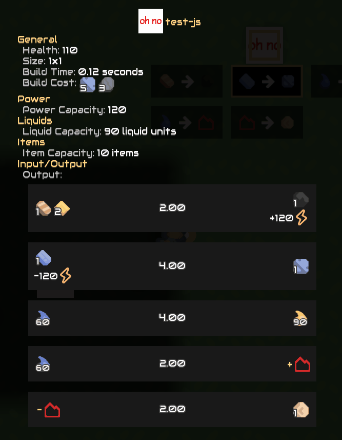

# [MultiCrafter Lib](https://liplum.github.io/MultiCrafterLib/) 

A Mindustry MultiCrafter lib-mod for Json and JavaScript mods.
Please check the [instruction](https://liplum.github.io/MultiCrafterLib/).
___

## How to Use

Please check the [instruction](https://liplum.github.io/MultiCrafterLib/) to learn MultiCrafter.

## Showcase

## Awesome

Some mods using *MultiCrafter Lib* are listed here, you may learn from them.

- [Java] [Omaloon](https://github.com/xStaBUx/Omaloon-mod-public) by `xStaBUx`

- [Json] [Z.P.G.M._Mod](https://github.com/r-omnom/Z.P.G.M._Mod) by `r-omnom`

- [Json] [Sapphirium](https://github.com/3Snake3/Sapphirium) by `3Snake3`

- [Json] [Windstorm (HJSON)](https://github.com/driftheque/WindstormHJSON) by `Drifted Notes & 1237` 
<!-- Drifted Notes // August 22, 2022
  windstorm was made by me when my alias was 1237.
  and on July 19th, 2022 i started a new alias (drifted notes),
  and a few days ago i ported this mod to hjson.

  i hope this won't confuse everyone.
  (liplum please don't delete this)
-->

Make a pull request to tell us if your mod is using MultiCrafter Lib. :rocket::rocket::rocket:

## Licence

GNU General Public License v3.0
