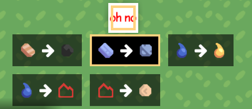
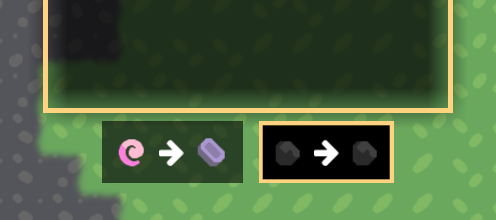
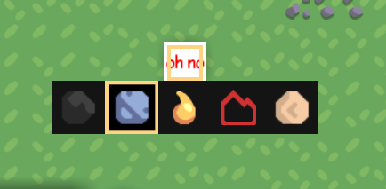
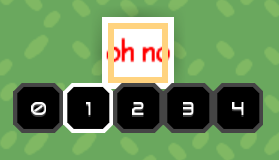
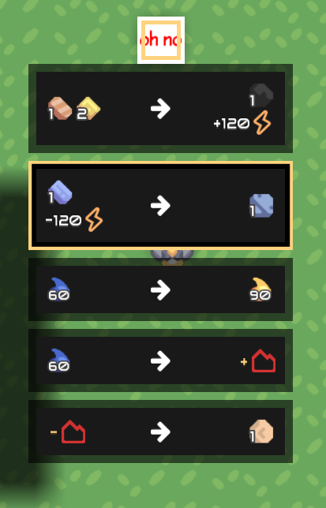
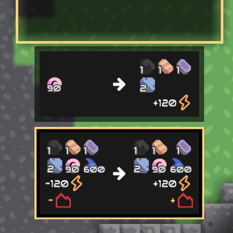
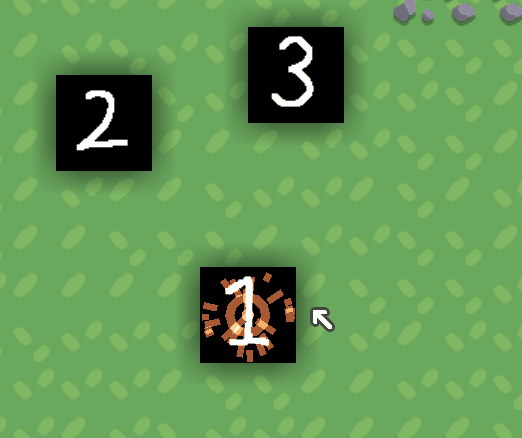

# Customize

## Menu Style

You can select which menu style detailed-described blow you want with a case-insensitive name.
The default menu style is `Transform`.

### Specify

=== "Hjson"

    Suppose you have such structure with a MultiCrafter, named `mine-crafter`  
    ```
    content/
    ├─ blocks/
    │  ├─ mine-crafter.hjson
    ```
    You can configure its menu style.
    ```hjson
    menu: Transform
    ```

=== "Json"

    Suppose you have such structure with a MultiCrafter, named `mine-crafter`  
    ```
    content/
    ├─ blocks/
    │  ├─ mine-crafter.json
    ```
    You can configure its menu style.
    ```json
    "menu": "Transform"
    ```

=== "JavaScript"

    Suppose you have a MultiCrafter, named `mine-crafter`
    ```javascript
    const multi = require("multi-crafter/lib")
    const mineCrafter = multi.MultiCrafter("mine-crafter")
    ```
    You can configure its menu style.
    ```javascript
    mineCrafter.menu= "Transform"
    ```

### Built-in Styles

=== "Transform"

    Type: Transform

    { loading=lazy width="280" }
    { loading=lazy width="280" }

=== "Simple"

    Type: Simple

    { loading=lazy width="280" }

=== "Number"

    Type: Number

    { loading=lazy width="280" }

=== "Detailed"

    Type: Detailed

    { loading=lazy width="280" }
    { loading=lazy width="280" }

## DrawRecipe

`DrawRecipe` drawer let you draw different images for each recipe.

**Type:** multicraft.DrawRecipe

It looks like a `DrawMulti`, but the drawer will be changed once another recipe is selected.

|     Field     |    Type     | Default |                           Note                            |
|:-------------:|:-----------:|:-------:|:---------------------------------------------------------:|
|    drawers    | DrawBlock[] |   {}    |              ordered drawers for each recipe              | 
| defaultDrawer |     int     |    0    | the default drawer index in `drawers` for icon generation |

Suppose you have those sprites with a MultiCrafter, named `mine-crafter`.

```
sprites/
├─ blocks/
│  ├─ mine-crafter-1.png
│  ├─ mine-crafter-2.png
│  ├─ mine-crafter-3.png
```

|                             Sprite                              |     File Name      |              
|:---------------------------------------------------------------:|:------------------:|
|  | mine-crafter-1.png |
|  | mine-crafter-2.png |
|  | mine-crafter-3.png |

{ loading=lazy width="280" }

=== "Hjson"

    ```hjson
    drawer: {
      type: multicraft.DrawRecipe
      defaultDrawer: 0 // an index used for generating the icon of this crafter. 
      drawers: [
        // for recipe 0
        { 
        type: DrawMulti
        drawers: [
          {
              type: DrawRegion
              suffix: -1
          }
          {
              type: DrawArcSmelt
          }
        ]
        }
        // for recipe 1
        { 
          type: DrawRegion
          suffix: -2
        }
        // for recipe 2
        { 
          type: DrawRegion
          suffix: -3
        }
      ]
    }
    ```

=== "Json"

    ```json
    "drawer": {
      "type": "multicraft.DrawRecipe",
      "drawers": [
        {
        "type": "DrawMulti",
        "drawers": [
          {
              "type": "DrawRegion",
              "suffix": "-1"
          },
          {
              "type": "DrawArcSmelt"
          },
        ]
        },
        {
          "type": "DrawRegion",
          "suffix":"-2"
        },
        {
          "type": "DrawRegion",
          "suffix": "-3"
        }
      ]
    }
    ```