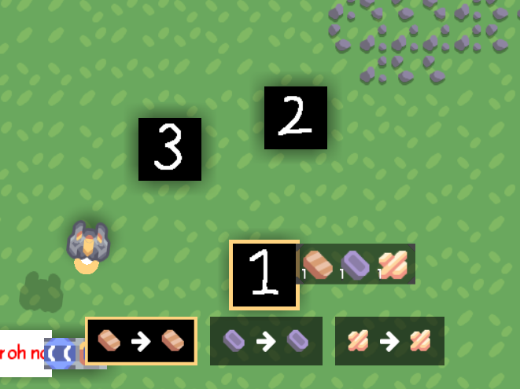

# Customize

## Menu Style

You can select which menu style detailed-described blow you want with a case-insensitive name.
The default menu style is `Transform`.

### Specify

=== "Hjson"

    Suppose you have such structure with a MultiCrafter, named `mine-crafter`  
    ```
    content/
    ├─ blocks/
    │  ├─ mine-crafter.hjson
    ```
    You can configure its menu style.
    ```hjson
    menu: Transform
    ```

=== "Json"

    Suppose you have such structure with a MultiCrafter, named `mine-crafter`  
    ```
    content/
    ├─ blocks/
    │  ├─ mine-crafter.json
    ```
    You can configure its menu style.
    ```json
    "menu": "Transform"
    ```

=== "JavaScript"

    Suppose you have a MultiCrafter, named `mine-crafter`
    ```javascript
    const multi = require("multi-crafter/lib")
    const mineCrafter = multi.MultiCrafter("mine-crafter")
    ```
    You can configure its menu style.
    ```javascript
    mineCrafter.menu= "Transform"
    ```

### Built-in Styles

=== "Transform"

    Type: Transform

    { loading=lazy width="280" }
    { loading=lazy width="280" }

=== "Simple"

    Type: Simple

    { loading=lazy width="280" }

=== "Number"

    Type: Number

    { loading=lazy width="280" }

=== "Detailed"

    Type: Detailed

    { loading=lazy width="280" }
    { loading=lazy width="280" }

## RecipeDraw

`RecipeDraw` drawer let you draw different images for each recipe.

**Type:** multicraft.DrawRecipe

It looks like a `DrawMulti`, but the drawer will be changed once another recipe is selected.

=== "Hjson"

    ```
    drawer: {
      type: multicraft.DrawRecipe
      drawers: [
        {
          type: DrawRegion
          suffix: -recipe1
        }
        {
          type: DrawRegion
          suffix: -2
        }
        {
          type: DrawRegion
          suffix: -top
        }
      ]}
    ```

=== "Json"

    ```
    "drawer": {
      "type": "multicraft.DrawRecipe"
      "drawers": [
        {
          "type": "DrawRegion"
          "suffix": "-recipe1"
        }
        {
          "type": "DrawRegion"
          "suffix": "-2"
        }
        {
          "type": "DrawRegion"
          "suffix": "-top"
        }
      ]}
    ```

|     Field     |    Type     | Default |                           Note                            |
|:-------------:|:-----------:|:-------:|:---------------------------------------------------------:|
|    drawers    | DrawBlock[] |   {}    |                        all drawers                        | 
| defaultDrawer |     int     |    0    | the default drawer index in `drawers` for icon generation |

{ loading=lazy width="280" }